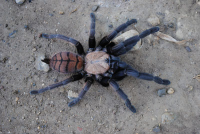
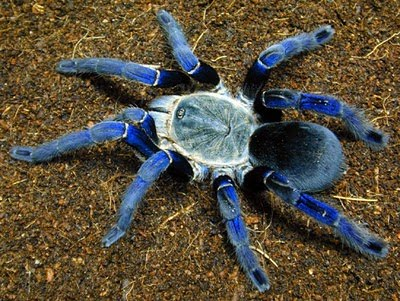

# m1-assignment
Module1_week1_day3

   
saved code:
<section class="oldwrld">    
     

        <h3>Chilobrachys Fimbriatus</h3> 
        
     

     

        	<h3>Haplopelma Lividum</h3> 
        	
     
 
     

        	<h3>Ceratogyrus Darlingi</h3>
        	
     
 
     

        	<h3>Costa Rican Tiger Rump</h3>
        	
     

	</section>